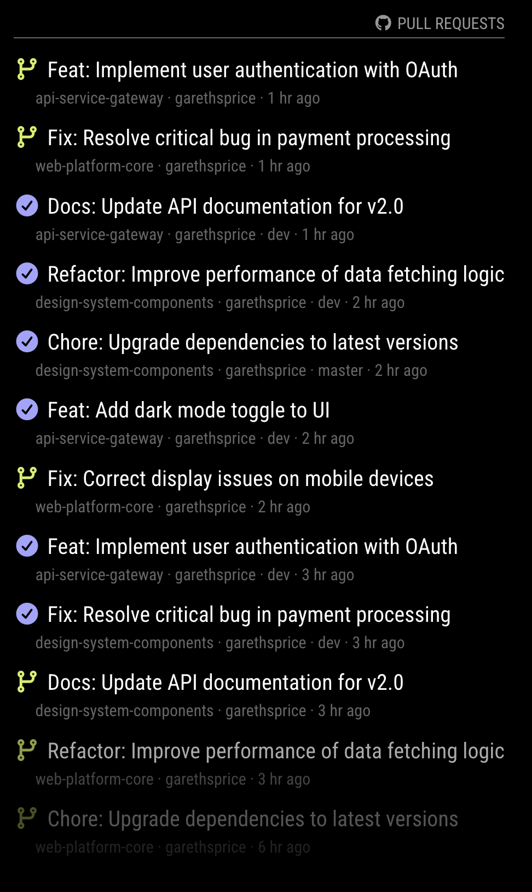

# MagicMirror² Module - GitHub Monitor

Display a live feed of pull requests across your GitHub repositories on your MagicMirror² dashboard. Supports private repos via token authentication.



## Features

- Unified chronological PR feed across multiple repositories
- PR state icons: open, merged, closed
- Author GitHub avatars
- Target branch shown for merged PRs (e.g. → main, → dev)
- Relative timestamps that update dynamically
- Incremental DOM updates — new PRs slide in without full re-render
- Bottom fade effect matching MagicMirror conventions
- Server-side API requests via node_helper (token never reaches the browser)
- Response caching to avoid redundant API calls on page refresh
- Supports GitHub Enterprise via `baseURL` config

## Installation

1. Navigate to the `/modules` folder of your MagicMirror²
2. Clone this repository: `git clone https://github.com/fpfuetsch/MMM-GitHub-Monitor.git`

No `npm install` needed — uses native Node.js fetch.

## Configuration

Add the module to `config/config.js`:

```javascript
{
  module: "MMM-GitHub-Monitor",
  position: "top_right",
  header: "Pull Requests",
  config: {
    accessToken: "ghp_your_token_here",  // GitHub PAT with repo scope
    maxItems: 12,
    updateInterval: 300000,  // 5 minutes
    repositories: [
      { owner: "your-org", name: "repo-1", pulls: { state: "open", loadCount: 5 } },
      { owner: "your-org", name: "repo-2", pulls: { state: "open", loadCount: 5 } },
    ],
  },
}
```

### Config Options

| Option | Default | Description |
|--------|---------|-------------|
| `accessToken` | `""` | GitHub Personal Access Token for private repos |
| `maxItems` | `10` | Maximum total PRs to display across all repos |
| `updateInterval` | `300000` (5 min) | API poll interval in milliseconds |
| `maxPullRequestTitleLength` | `80` | Truncate PR titles beyond this length |
| `repositories` | `[]` | Array of repository configs (see below) |
| `baseURL` | `https://api.github.com` | API base URL (for GitHub Enterprise) |

### Per-repository `pulls` options

| Option | Default | Description |
|--------|---------|-------------|
| `state` | `"open"` | PR state filter: `"open"`, `"closed"`, or `"all"` |
| `loadCount` | `10` | Max PRs to fetch per repo |
| `sort` | `"created"` | Sort by `"created"` or `"updated"` |
| `direction` | `"desc"` | `"asc"` or `"desc"` |

## Authentication

When `accessToken` is set, all GitHub API requests are made server-side via `node_helper.js` with the token in the `Authorization` header. The token never reaches the browser.

When no token is configured, the module is not functional for private repos and will be subject to GitHub's unauthenticated rate limit (60 requests/hour).

Generate a Personal Access Token at https://github.com/settings/tokens with `repo` scope.

## Update

Navigate to the module folder and run `git pull`.
